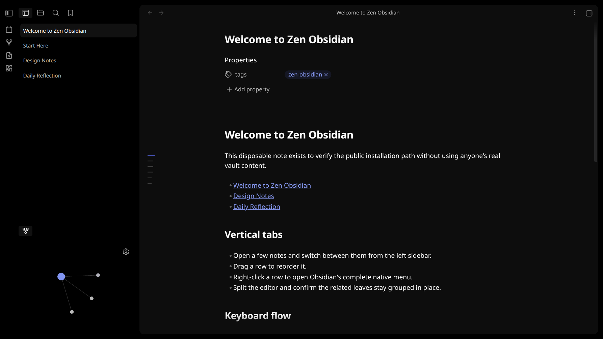

# Zen Obsidian

A quiet, AMOLED-black, note-first Obsidian desktop setup with native-feeling vertical tabs.



This repository is a modular kit, not a replacement `.obsidian` folder. It includes only scoped Zen presets and disposable demo notes—never a workspace snapshot, personal vault content, credentials, or a complete hotkey/plugin-data dump.

[Download the latest release](https://github.com/Asforaa/zen-obsidian/releases/latest) or use the source-based installer below.

## What is included

| Layer | Status | Purpose |
|---|---|---|
| **Zen AMOLED** | Essential | The exact color-variable foundation, derived from Vanilla AMOLED under its ISC License. |
| **Vertical Tabs** | Essential | Native left-sidebar tabs, split sessions, full native menus, safe close/restore, the contained writing surface, and optional Local Graph provisioning. |
| **Hider** | Essential | Removes the vault profile block and editor status bar using the bundled two-flag preset. |
| **Zen Obsidian CSS** | Essential for the complete look | Centers launchers, removes redundant window chrome, and hides the duplicate File Explorer new-note control. |
| **Modern Outline patch** | Included by default, removable | An always-available document minimap with immediate scroll tracking. |
| **Tab Switcher preset** | Included by default, removable | Browser-style `Ctrl+Tab` cycling restricted to main Markdown note tabs, without a modal. |

The theme is installed as **Zen AMOLED**, beside—not over—the upstream Vanilla AMOLED theme.

## Safe automated installation

Obsidian runs the distributed JavaScript and CSS directly; end users do not need Bun at runtime. [Bun](https://bun.sh/) is required only for this repository's automated installer and source build commands. Manual installation needs no JavaScript package manager.

```bash
git clone https://github.com/Asforaa/zen-obsidian.git
cd zen-obsidian
bun run verify
bun run install -- "/absolute/path/to/your/vault" --dry-run --configure
bun run install -- "/absolute/path/to/your/vault" --configure
```

The standard command installs the complete setup, including Modern Outline and Tab Switcher. Add `--without-modern-outline` or `--without-tab-switcher` to omit either component. Add `--demo-note` only for a disposable test vault; its one-shot `Start Here` page links three sample notes so Local Graph opens with a visible four-node cluster.

The installer:

- never touches Markdown notes unless `--demo-note` is explicitly supplied;
- preserves unrelated plugins, snippets, settings, and shortcuts;
- skips identical files;
- refuses to replace different existing component files;
- backs up every JSON file before an opt-in configuration merge.

With `--configure`, the Zen preset also asks Vertical Tabs to create one Local Graph section in the left sidebar when none exists. It uses the same 34.76% height as the reference setup and never replaces `workspace.json`.

If you deliberately want to update an existing Zen component, add `--replace`. The replaced files are backed up under `.obsidian/zen-obsidian-backups/` first.

See [Installation](docs/INSTALLATION.md), [Components](docs/COMPONENTS.md), [Shortcuts](docs/SHORTCUTS.md), and [Compatibility](docs/COMPATIBILITY.md).

## Release downloads

- `vertical-tabs-*.zip` — the installable plugin build.
- `zen-amoled-*.zip` — the essential theme.
- `hider-*.zip` — Hider's upstream build plus the two-flag Zen preset.
- `zen-obsidian.css` — the finishing snippet.
- `modern-outline-*-zen.zip` — the included-by-default patched outline build and preset.
- `tab-switcher-*-zen.zip` — the included-by-default tested Tab Switcher build and Markdown-only preset.

These are separate on purpose: existing vault users can install only the layers they want without extracting a complete configuration directory.

## Build Vertical Tabs

```bash
cd packages/vertical-tabs
bun install
bun run check
bun run build
```

## Privacy boundary

This project intentionally excludes `workspace.json`, full `appearance.json` and `hotkeys.json` files, enabled-plugin dumps, LiveSync data, and personal vault content.

## License

Zen Obsidian and Vertical Tabs are MIT licensed. Bundled derivatives retain their upstream notices; see [Third-party notices](THIRD_PARTY_NOTICES.md).
